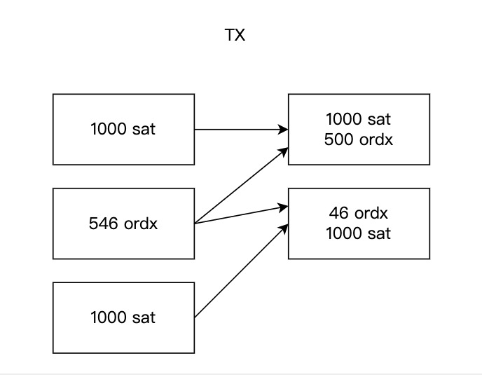

拆分问题
====

粉尘问题仅仅是现在硬件条件达不到BTC网络运行的最理想的要求所产生的一个临时性的问题。根据中本聪的设计，sat是比特币的最小单位，设置粉尘限制明显违背了中本聪的设计初衷。  

我们从另外一个角度思考这个问题。假设下面的条件成立：
1. BTC价值提升100倍，比如一个BTC价值1亿港币。
2. 硬件和网络条件提升100倍。

假如上面的条件成立，粉尘问题还算是问题吗？这个时候，一个sat相当于1港币，转移一个sat就成为了很常见的需求了。从发展的角度来看，上面的假设条件，需要多久能达成？我们确信，在不久的将来，utxo会直接支持转移一个sat。甚至在这之后，一个sat的价值高到一定程度，需要在BTC的二层网络上对sat拆分成更小的单位。基于上面的结论，我们不准备在BTC主网上解决当前utxo最小限制的问题。  

当然拆分资产的需求依然存在。为了在目前的条件下对资产进行拆分，我们提供了3个方案：
1. 最佳方案：在BTC的二层网络上解决拆分问题。这是我们后续的主要工作之一，新协议名字为Ordinals Lightning DEX Protocol（OLD协议）。在支持OLD协议的DEX上，资产几乎可以无限拆分，但是转回主网时，依然需要遵循当前最小utxo的限制，但是其中可以只有一个sat有绑定的资产。
2. 临时方案1：对资产定义慎重考量，让每一份资产绑定足够多的sat，比如10000个sat，那至少可以拆分成10个utxo，每个有1000个sat。
3. 临时方案2：灵活利用UTXO，将一个铭刻了某种资产的最小UTXO（546聪），结合其他两个UTXO，可以将这个UTXO包含的资产拆成更小的任意两部分。重复这个过程，就可以达成很好的结果。缺点是操作太复杂。  

