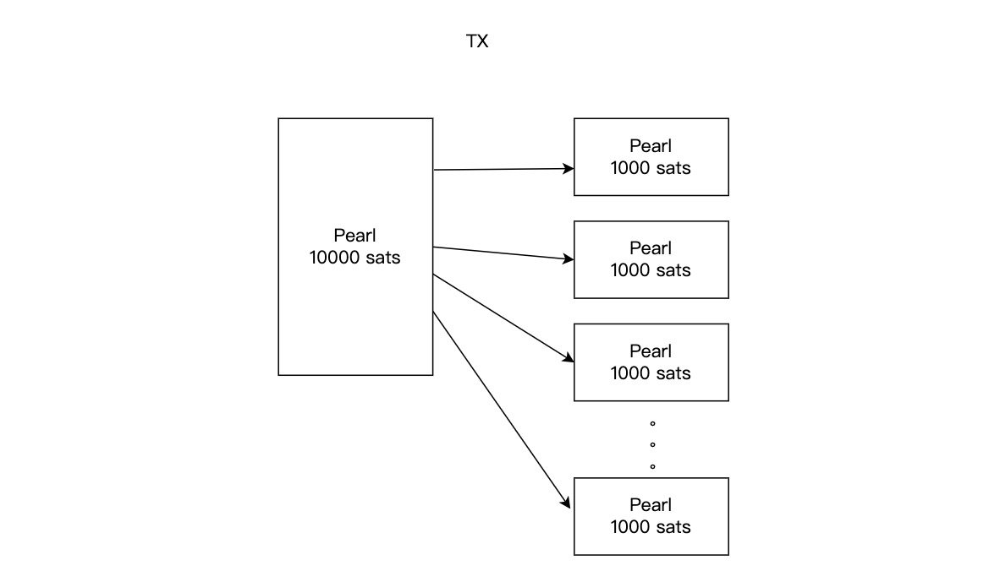
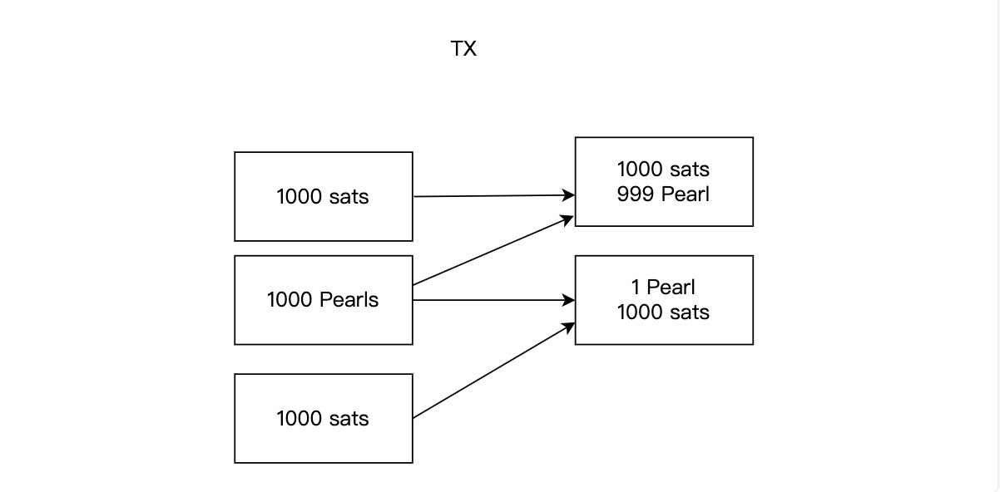

拆分方案
====

对ordx资产来说，拆分根本不是问题，这是btc的utxo模型就原生支持的。即使现在网络因为硬件和网络的限制，不允许聪太少的utxo，也可以通过灵活构造TX的方式将ordx资产拆到一个utxo中只有一个聪包含ordx资产。具体拿 #Pearl 来作为例子说明下。

第一步：一份Pearl含有10000聪，先使用sparrow等工具，将其拆分为10分。（假设没有矿工费）  

其实到这里，已经可以满足大多情况下的需求了。一张Pearl拆成了十张，就算原来一张涨到1万u，拆成十张，也可以对付很长时间了。如果还不满足，继续看第二步

第二步：灵活使用utxo模型，将Pearl资产拆分为1聪  

通过上面的模型，想怎么拆就怎么拆，如果不觉得1个Pearl价格太低的话。实际上我们不建议做第二步，一方面是目前一张Pearl的价格很低，没有必要继续拆；另一方面是会导致资产碎片化。等ordx协议支持的二层网络搭建起来后，我们推荐不拆分，直接上二层网络交易。

第三步：直接转入二层网络进行拆分。二层网络可以进行无限拆分，不受一币一聪的限制，只是在转回主网时，必须以聪为单位。而且如果有足够的ordx资产，可以还原成Ordinals NFT转回一层。

